# Big Data TP2 — Cloud Provider Analytics

**Materia:** 72.80 Big Data — ITBA  
**Entrega:** Segundo Parcial — 15/06/2026  
**Integrantes:**
- Barnatan, Martin Alejandro (64463)
- Bendayan, Alberto Leonel (62786)
- Boullosa Gutierrez, Juan Cruz (63414)

---

## Objetivo

MVP técnico end-to-end que conecta las capas:

```
Landing → Bronze → Silver → Gold → Serving (Cassandra/AstraDB)
```

Implementado con PySpark + Structured Streaming, Parquet como almacenamiento intermedio y Cassandra/AstraDB como capa de serving query-first.

---

## Arquitectura


**Patrón Lambda:** camino batch para maestros y facturación, camino streaming para eventos de uso. Ambos convergen en Silver y luego en Gold.

---

## Estructura del repositorio

```
src/
  run_pipeline.py          # Pipeline completo Landing → Gold
  load_cassandra.py        # Carga Gold marts → AstraDB (foreachBatch)
  query_cassandra.py       # Consultas demo contra AstraDB
  astra_config.py          # Carga de credenciales desde .env
  astra_schema.py          # Creación de keyspace y tablas
cql/
  01_create_keyspace.cql   # Keyspace cloud_analytics
  02_create_tables.cql     # 7 tablas query-first
  03_queries_demo.cql      # 7 consultas de demo
docs/
  decision_log.md          # Decisiones de arquitectura
cloud_provider_challenge_dataset_v1/
  datalake/
    landing/               # Datos crudos (CSV + JSONL) — inmutable
    bronze/                # Parquet tipificado, particionado por ingest_date/usage_date
    silver/                # Eventos conformados y enriquecidos, particionado por usage_date
    gold/                  # Marts agregados, particionado por fecha
    quarantine/            # Registros rechazados por DQ, particionado por usage_date
  checkpoints/             # Checkpoints de Structured Streaming
```

---

## Requisitos previos

- Python 3.10+
- [uv](https://docs.astral.sh/uv/getting-started/installation/)
- Java 11, 17 o 21 (Spark 3.5.x no soporta Java 22+)
- Dataset en `cloud_provider_challenge_dataset_v1/`
- Cuenta en [AstraDB](https://astra.datastax.com)

---

## Configuración de AstraDB

### 1. Crear la base de datos

1. Ingresar a [astra.datastax.com](https://astra.datastax.com)
2. Crear una base de datos Serverless
3. Crear el keyspace `cloud_analytics`
4. Descargar el **Secure Connect Bundle** (`secure-connect-*.zip`) y copiarlo a la raíz del repo

### 2. Obtener credenciales

1. Panel AstraDB → **Settings → Token Management**
2. Crear token con rol `Database Administrator`
3. Guardar `Client ID` y `Client Secret`

### 3. Configurar `.env`

```bash
cp .env.example .env
```

```env
ASTRA_CLIENT_ID=<tu_client_id>
ASTRA_CLIENT_SECRET=<tu_client_secret>
ASTRA_KEYSPACE=cloud_analytics
# El bundle se detecta automáticamente si hay un único secure-connect-*.zip en la raíz
# ASTRA_SECURE_CONNECT_BUNDLE=secure-connect-nombre.zip
```

---

## Instalación

```bash
uv sync
```

---

## Ejecución

### Paso 1 — Pipeline completo (Landing → Gold)

```bash
uv run python -m src.run_pipeline
```

Opciones:

```bash
uv run python -m src.run_pipeline \
  --landing        cloud_provider_challenge_dataset_v1/datalake/landing \
  --datalake-out   cloud_provider_challenge_dataset_v1/datalake \
  --checkpoint-out cloud_provider_challenge_dataset_v1/checkpoints
```

### Paso 2 — Carga a AstraDB

```bash
uv run python -m src.load_cassandra
```

Cargar solo algunas tablas:

```bash
uv run python -m src.load_cassandra --tables org_daily_usage_by_service revenue_by_org_month
```

Todas las opciones:

```bash
uv run python -m src.load_cassandra \
  --datalake       cloud_provider_challenge_dataset_v1/datalake \
  --checkpoint-out cloud_provider_challenge_dataset_v1/checkpoints \
  --keyspace       cloud_analytics \
  --bundle         secure-connect-nombre.zip \
  --client-id      <client_id> \
  --client-secret  <client_secret> \
  --tables         org_daily_usage_by_service cost_anomaly_mart
```

Tablas disponibles: `org_daily_usage_by_service` · `org_service_cost_14d` · `revenue_by_org_month` · `cost_anomaly_mart` · `tickets_by_org_date` · `tickets_critical_by_org_date` · `genai_tokens_by_org_date`

### Paso 3 — Consultas demo

```bash
uv run python -m src.query_cassandra
```

Filtros disponibles:

```bash
# Consultas específicas
uv run python -m src.query_cassandra --query 1 2 3

# Filtrar por org y rango de fechas
uv run python -m src.query_cassandra \
  --org-id   org_4zw9xa3k \
  --min-date 2025-08-01 \
  --max-date 2025-08-31

# Fecha puntual para consulta 6 (extra)
uv run python -m src.query_cassandra \
  --query 6 \
  --org-id     org_4zw9xa3k \
  --point-date 2025-08-14

# Top-N con N configurable
uv run python -m src.query_cassandra \
  --query 2 \
  --org-id org_4zw9xa3k \
  --top-n  3

# Todo junto
uv run python -m src.query_cassandra \
  --query    1 2 3 4 5 6 7 \
  --org-id   org_4zw9xa3k \
  --min-date 2025-08-01 \
  --max-date 2025-08-31 \
  --point-date 2025-08-14
```

Consultas disponibles:

**Consigna (1-5)**

| # | Tabla | Descripción |
|---|---|---|
| 1 | `org_daily_usage_by_service` | Costos y requests diarios por org y servicio en rango de fechas |
| 2 | `org_service_cost_14d` | Top-N servicios por costo acumulado en los últimos 14 días |
| 3 | `tickets_critical_by_org_date` | Evolución de tickets críticos y SLA breach por día (últimos 30 días) |
| 4 | `revenue_by_org_month` | Revenue mensual con créditos/impuestos (normalizado a USD) |
| 5 | `genai_tokens_by_org_date` | Tokens GenAI y costo estimado por día |

**Extra (6-7)**

| # | Tabla | Descripción |
|---|---|---|
| 6 | `org_daily_usage_by_service` | Detalle de servicios y anomalías en una fecha puntual |
| 7 | `cost_anomaly_mart` | Eventos anómalos de costo por org y rango de fechas |

> Sin parámetros, cada consulta toma el primer `org_id` disponible y el rango de fechas completo del mart correspondiente, leídos desde los parquets Gold.

---

## Decisiones técnicas

### Patrón Lambda

Se mantiene Lambda porque el caso combina dos necesidades distintas: procesamiento batch para maestros y facturación (datos históricos, carga puntual) y procesamiento near real-time para eventos de uso (stream continuo). Kappa requeriría tratar todos los datos como stream, lo que agrega complejidad innecesaria para fuentes naturalmente batch.

### Medallion Architecture

| Capa | Responsabilidad |
|---|---|
| Landing | Fuente cruda inmutable. Base para reprocesamiento. |
| Bronze | Tipificación explícita, columnas técnicas (`ingest_ts`, `source_file`), dedupe por clave natural. Sin lógica de negocio. |
| Silver | Conformado, joins de enriquecimiento, features analíticas, reglas de calidad, quarantine. |
| Gold | Marts agregados listos para serving. Sin joins en tiempo de consulta. |
| Serving | Cassandra/AstraDB query-first, baja latencia. |

### Particionado y small files

Todas las escrituras batch usan `repartition(col_partición).coalesce(1)` para consolidar 1 archivo por partición de fecha, evitando el problema de small files. El streaming Bronze genera múltiples archivos chicos (1 por micro-batch por fecha); se aplica un paso de **reparquet** inmediatamente después de que el stream termina, consolidando también a 1 archivo por partición. Para datasets más grandes el target sería `ceil(size_partición / 128 MB)` archivos.

### Calidad de datos

5 reglas activas en Silver:

1. `event_id` no nulo
2. `event_ts` parseable y no nulo
3. `unit` no nulo cuando existe `value`
4. `cost_usd_increment >= -0.01` (valores menores → quarantine)
5. `schema_version` en `{1, 2}`

Los registros inválidos se escriben en `quarantine/usage_events` con columna `dq_reason` que concatena todas las reglas violadas.

### Detección de anomalías

La detección opera en dos niveles:

**Nivel 1 — Regla de calidad (quarantine):** eventos con `cost_usd_increment < -0.01` se rechazan directamente en Silver. Costos negativos de esa magnitud son datos inválidos o errores de ingesta, no ajustes legítimos.

**Nivel 2 — Flag de anomalía (Silver):** sobre los eventos válidos, se marca `is_cost_anomaly = true` si se cumple alguna de estas condiciones:

- `cost_usd_increment < 0`: costos levemente negativos que pasaron el umbral de quarantine (-0.01) son técnicamente válidos (ajustes, créditos) pero merecen atención.
- `cost_usd_increment > p90(service)`: el evento supera el percentil 90 del costo histórico para ese tipo de servicio.

**Por qué p90 y no un umbral fijo:** cada servicio tiene un rango de costos propio — un evento de `genai` puede costar naturalmente más que uno de `networking`. Un umbral fijo como `> $50` ignoraría esa diferencia. El p90 se adapta a la distribución real de cada servicio.

**Por qué percentil y no z-score o MAD:** los costos tienen distribución fuertemente sesgada hacia la derecha (muchos eventos baratos, pocos muy caros). El z-score asume distribución normal y sobreestima anomalías en la cola. El MAD es más robusto pero requiere calcular la mediana absoluta de desviaciones, lo que en Spark implica múltiples pasadas. `approx_percentile` es una función nativa de Spark, eficiente en un solo paso.

El flag `is_cost_anomaly` se agrega en Silver y se agrega en Gold como `anomaly_event_count` en `org_daily_usage_by_service` y como mart dedicado en `cost_anomaly_mart`.

### Evolución de esquema (schema_version)

El stream de eventos tiene dos versiones de esquema conviviendo en el mismo directorio:

| Campo | v1 | v2 |
|---|---|---|
| `schema_version` | `1` | `2` |
| `carbon_kg` | ausente (null) | presente |
| `genai_tokens` | ausente (null) | presente (solo servicio `genai`) |

**Estrategia de compatibilización:** el esquema de Bronze declara todos los campos de ambas versiones. Cuando Spark lee un evento v1 que no tiene `carbon_kg` ni `genai_tokens`, los lee como `null`. En Silver se normalizan con `coalesce(campo, 0.0)` — los eventos v1 quedan con esos campos en `0.0` y se procesan igual que los v2. No hay bifurcación de lógica ni pipelines separados por versión.

La regla de calidad `schema_version ∈ {1, 2}` rechaza a quarantine cualquier evento con versión nula o desconocida, protegiéndose ante una eventual v3 sin romper el pipeline.

### Cassandra query-first

Cada tabla modela exactamente la consulta que responde. `org_id` es siempre partition key (todas las queries filtran por org), fecha como clustering key con orden descendente (se consulta lo más reciente), columnas extra de clustering donde la query necesita discriminar más fino:

| Tabla | Primary Key | Nota |
|---|---|---|
| `org_daily_usage_by_service` | `((org_id), usage_date DESC, service ASC)` | |
| `revenue_by_org_month` | `((org_id), month DESC)` | |
| `cost_anomaly_mart` | `((org_id), usage_date DESC, service ASC)` | |
| `tickets_by_org_date` | `((org_id), ticket_date DESC, category ASC, severity ASC)` | |
| `genai_tokens_by_org_date` | `((org_id), usage_date DESC)` | |
| `org_service_cost_14d` | `((org_id), total_cost_usd DESC, service ASC)` | derivada · `total_cost_usd` como clustering key permite `LIMIT N` para top-N nativo |
| `tickets_critical_by_org_date` | `((org_id), ticket_date DESC)` | derivada · pre-filtrada a `severity=critical`, elimina la necesidad de especificar `category` y `severity` en la query |

### Idempotencia

- **Parquet**: `mode("overwrite")` en todas las capas batch. Re-ejecutar reemplaza la salida previa.
- **Streaming**: checkpointing garantiza que cada archivo JSONL se procesa exactamente una vez. `dropDuplicates(["event_id"])` maneja late data.
- **Cassandra**: upsert natural por primary key determinística. Re-cargar no duplica registros.

---

## Diccionario de datos

Campos clave de cada tabla Cassandra. Las tablas marcadas con _(derivada)_ no tienen Parquet Gold propio: se calculan al momento de la carga desde otro mart.

### `org_daily_usage_by_service`

| Campo | Tipo | Descripción |
|---|---|---|
| `org_id` | text | Identificador único de la organización (partition key) |
| `usage_date` | date | Fecha del consumo (clustering key DESC) |
| `service` | text | Tipo de servicio: `compute`, `storage`, `database`, `networking`, `analytics`, `genai` |
| `event_count` | bigint | Cantidad de eventos de uso registrados en esa fecha |
| `requests` | double | Número de requests al servicio |
| `cpu_hours` | double | Horas de CPU consumidas |
| `storage_gb_hours` | double | GB-hora de almacenamiento consumido |
| `genai_tokens` | double | Tokens de modelos GenAI consumidos (presente desde schema_version=2) |
| `carbon_kg` | double | Emisiones de CO₂ estimadas en kg (presente desde schema_version=2) |
| `daily_cost_usd` | double | Costo diario acumulado en USD |
| `anomaly_event_count` | bigint | Eventos marcados como anómalos (costo fuera de rango por z-score/MAD/percentil) |

### `org_service_cost_14d` _(derivada)_

Calculada a partir de `org_daily_usage_by_service`, filtrando los últimos 14 días y agrupando por `org_id + service`. `total_cost_usd` es clustering key DESC, lo que permite obtener el top-N nativo con `LIMIT N`.

| Campo | Tipo | Descripción |
|---|---|---|
| `org_id` | text | Identificador de la organización (partition key) |
| `service` | text | Tipo de servicio |
| `total_cost_usd` | double | Costo acumulado en los últimos 14 días (clustering key DESC) |
| `event_count` | bigint | Total de eventos en el período |
| `requests` | double | Total de requests en el período |

### `revenue_by_org_month`

| Campo | Tipo | Descripción |
|---|---|---|
| `org_id` | text | Identificador de la organización (partition key) |
| `month` | date | Mes de facturación (clustering key DESC) |
| `gross_revenue_usd` | double | Ingresos brutos en USD antes de ajustes |
| `credits_usd` | double | Créditos y descuentos aplicados |
| `taxes_usd` | double | Impuestos aplicados |
| `net_revenue_usd` | double | Ingreso neto: `gross - credits - taxes` |
| `invoice_count` | bigint | Cantidad de facturas emitidas en el mes |

### `tickets_critical_by_org_date` _(derivada)_

Calculada a partir de `tickets_by_org_date`, filtrando `severity = 'critical'` y agrupando por `org_id + ticket_date`. El `avg_csat` es un promedio ponderado por cantidad de tickets.

| Campo | Tipo | Descripción |
|---|---|---|
| `org_id` | text | Identificador de la organización (partition key) |
| `ticket_date` | date | Fecha del ticket (clustering key DESC) |
| `ticket_count` | bigint | Tickets críticos del día |
| `resolved_ticket_count` | bigint | Tickets críticos resueltos |
| `open_ticket_count` | bigint | Tickets críticos aún abiertos |
| `sla_breach_count` | bigint | Tickets que superaron el tiempo de resolución acordado |
| `sla_breach_rate` | double | Tasa de breach: `sla_breach_count / ticket_count` |
| `avg_csat` | double | Puntaje de satisfacción promedio ponderado por tickets (escala 1-5) |

### `genai_tokens_by_org_date`

| Campo | Tipo | Descripción |
|---|---|---|
| `org_id` | text | Identificador de la organización (partition key) |
| `usage_date` | date | Fecha del consumo (clustering key DESC) |
| `genai_tokens` | double | Total de tokens consumidos en modelos GenAI |
| `estimated_token_cost_usd` | double | Costo estimado en USD basado en consumo de tokens |
| `requests` | double | Cantidad de requests a servicios GenAI |
| `carbon_kg` | double | Emisiones de CO₂ estimadas en kg |

### `cost_anomaly_mart`

| Campo | Tipo | Descripción |
|---|---|---|
| `org_id` | text | Identificador de la organización (partition key) |
| `usage_date` | date | Fecha del evento (clustering key DESC) |
| `service` | text | Servicio donde se detectó la anomalía |
| `anomaly_event_count` | bigint | Eventos con costo anómalo detectado (z-score, MAD o p99) |
| `negative_cost_event_count` | bigint | Eventos con `cost_usd_increment < -0.01` |
| `high_cost_event_count` | bigint | Eventos con costo por encima del umbral del percentil 99 |
| `anomaly_cost_usd` | double | Costo total acumulado de los eventos anómalos |
| `max_event_cost_usd` | double | Costo máximo registrado en un evento individual |
| `min_event_cost_usd` | double | Costo mínimo registrado en un evento individual |

### `tickets_by_org_date`

| Campo | Tipo | Descripción |
|---|---|---|
| `org_id` | text | Identificador de la organización (partition key) |
| `ticket_date` | date | Fecha del ticket (clustering key DESC) |
| `category` | text | Categoría: `billing`, `technical`, `onboarding`, `other` |
| `severity` | text | Severidad: `critical`, `high`, `medium`, `low` |
| `ticket_count` | bigint | Cantidad de tickets |
| `resolved_ticket_count` | bigint | Tickets resueltos en la fecha |
| `open_ticket_count` | bigint | Tickets aún abiertos |
| `sla_breach_count` | bigint | Tickets que superaron el SLA |
| `sla_breach_rate` | double | Tasa de breach: `sla_breach_count / ticket_count` |
| `avg_csat` | double | Puntaje de satisfacción promedio (escala 1-5) |

---

## Evidencias

### Conteos por capa

| Zona / Tabla | Filas | Archivos Parquet |
|---|---|---|
| bronze / customers_orgs | 80 | 1 |
| bronze / users | 800 | 1 |
| bronze / billing_monthly | 240 | 1 |
| bronze / usage_events_stream | 8,395 | 60 (1 por fecha) |
| silver / usage_events | 7,946 | 60 (1 por fecha) |
| quarantine / usage_events | 449 | 60 (1 por fecha) |
| gold / org_daily_usage_by_service | 5,406 | 60 (1 por fecha) |
| gold / revenue_by_org_month | 240 | 3 (1 por mes) |
| gold / cost_anomaly_mart | 12 | 11 (1 por fecha) |
| gold / tickets_by_org_date | 995 | 115 (1 por fecha) |
| gold / genai_tokens_by_org_date | 517 | 60 (1 por fecha) |

### Tamaños de tablas Parquet

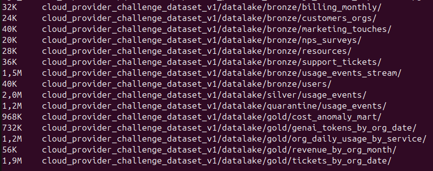

### Estructura de particiones Gold

Cada partición contiene un único archivo Snappy — evidencia del reparquet funcionando correctamente (sin small files):

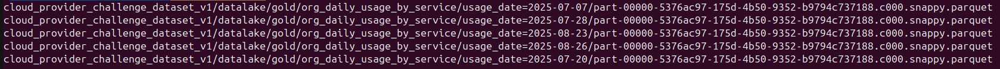

### Idempotencia

Re-ejecutar el pipeline produce exactamente los mismos conteos. Silver y Gold usan `overwrite`; el streaming recrea el Bronze desde el checkpoint y aplica el reparquet. Los conteos de la tabla anterior son estables entre ejecuciones.

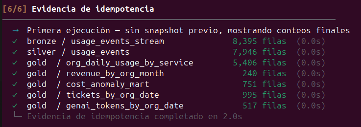
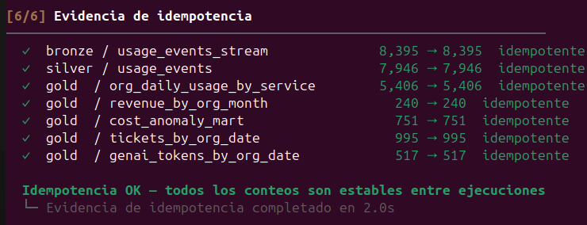

### Quarantine — ejemplo de registros rechazados

Registros en `quarantine/usage_events` con `dq_reason` indicando la regla violada:

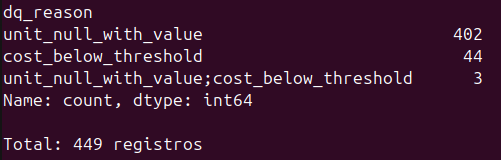

### Capturas de consultas AstraDB

**Consultas de la consigna**

**Query 1** — Costos y requests diarios por org y servicio

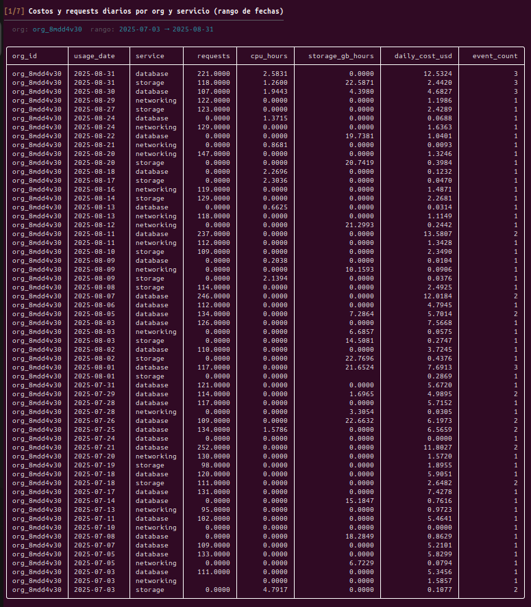

**Query 2** — Top-N servicios por costo acumulado (últimos 14 días)

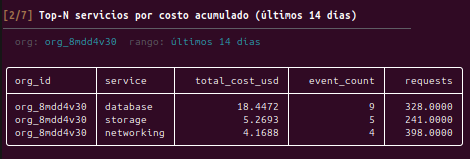

**Query 3** — Evolución de tickets críticos y SLA breach por día (últimos 30 días)

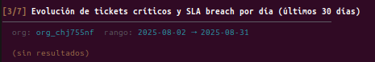

**Query 4** — Revenue mensual por organización

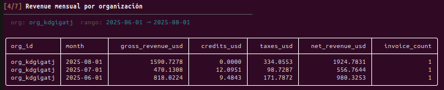

**Query 5** — Tokens GenAI y costo estimado por día

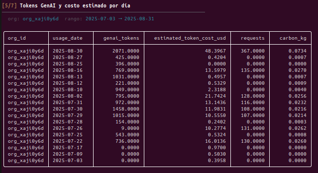

**Consultas extra**

**Query 6** — Detalle de servicios y anomalías en una fecha puntual

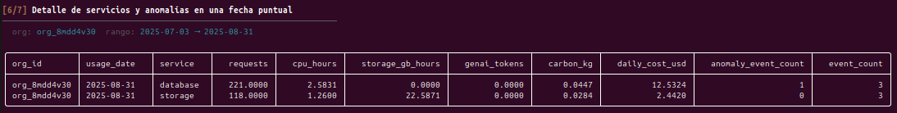

**Query 7** — Eventos anómalos de costo

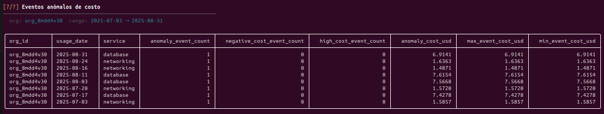

