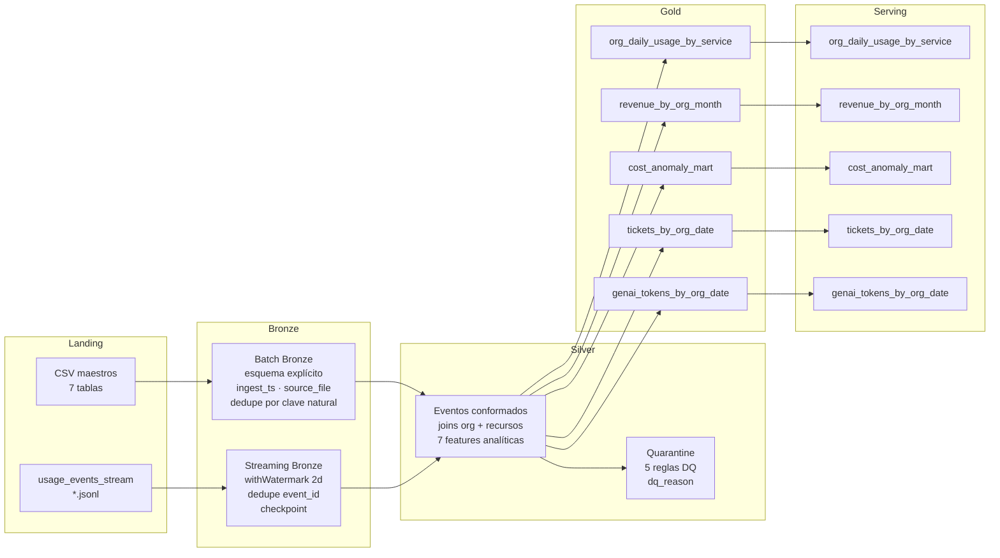

# Big Data TP2 — Cloud Provider Analytics

**Materia:** 72.80 Big Data — ITBA  
**Entrega:** Segundo Parcial — 15/06/2026  
**Integrantes:**
- Barnatan, Martin Alejandro (64463)
- Bendayan, Alberto Leonel (62786)
- Boullosa Gutierrez, Juan Cruz (63414)

---

## Objetivo

MVP técnico end-to-end que conecta las capas:

```
Landing → Bronze → Silver → Gold → Serving (Cassandra/AstraDB)
```

Implementado con PySpark + Structured Streaming, Parquet como almacenamiento intermedio y Cassandra/AstraDB como capa de serving query-first.

---

## Arquitectura



**Patrón Lambda:** camino batch para maestros y facturación, camino streaming para eventos de uso. Ambos convergen en Silver y luego en Gold.

---

## Estructura del repositorio

```
src/
  tp2_pipeline.py          # Pipeline completo Landing → Gold
  load_cassandra.py        # Carga Gold marts → AstraDB (foreachBatch)
  query_cassandra.py       # Consultas demo contra AstraDB
  astra_config.py          # Carga de credenciales desde .env
  astra_schema.py          # Creación de keyspace y tablas
cql/
  01_create_keyspace.cql   # Keyspace cloud_analytics
  02_create_tables.cql     # 5 tablas query-first
  03_queries_demo.cql      # 6 consultas de demo
docs/
  decision_log.md          # Decisiones de arquitectura
cloud_provider_challenge_dataset_v1/
  datalake/
    landing/               # Datos crudos (CSV + JSONL) — inmutable
    bronze/                # Parquet tipificado, particionado por ingest_date/usage_date
    silver/                # Eventos conformados y enriquecidos, particionado por usage_date
    gold/                  # Marts agregados, particionado por fecha
    quarantine/            # Registros rechazados por DQ, particionado por usage_date
  checkpoints/             # Checkpoints de Structured Streaming
```

---

## Requisitos previos

- Python 3.10+
- [uv](https://docs.astral.sh/uv/getting-started/installation/)
- Java 11, 17 o 21 (Spark 3.5.x no soporta Java 22+)
- Dataset en `cloud_provider_challenge_dataset_v1/`
- Cuenta en [AstraDB](https://astra.datastax.com)

---

## Configuración de AstraDB

### 1. Crear la base de datos

1. Ingresar a [astra.datastax.com](https://astra.datastax.com)
2. Crear una base de datos Serverless
3. Crear el keyspace `cloud_analytics`
4. Descargar el **Secure Connect Bundle** (`secure-connect-*.zip`) y copiarlo a la raíz del repo

### 2. Obtener credenciales

1. Panel AstraDB → **Settings → Token Management**
2. Crear token con rol `Database Administrator`
3. Guardar `Client ID` y `Client Secret`

### 3. Configurar `.env`

```bash
cp .env.example .env
```

```env
ASTRA_CLIENT_ID=<tu_client_id>
ASTRA_CLIENT_SECRET=<tu_client_secret>
ASTRA_KEYSPACE=cloud_analytics
# El bundle se detecta automáticamente si hay un único secure-connect-*.zip en la raíz
# ASTRA_SECURE_CONNECT_BUNDLE=secure-connect-nombre.zip
```

---

## Instalación

```bash
uv sync
```

---

## Ejecución

### Paso 1 — Pipeline completo (Landing → Gold)

```bash
uv run python -m src.tp2_pipeline
```

Opciones:

```bash
uv run python -m src.tp2_pipeline \
  --landing        cloud_provider_challenge_dataset_v1/datalake/landing \
  --datalake-out   cloud_provider_challenge_dataset_v1/datalake \
  --checkpoint-out cloud_provider_challenge_dataset_v1/checkpoints
```

### Paso 2 — Carga a AstraDB

```bash
uv run python -m src.load_cassandra
```

Cargar solo algunas tablas:

```bash
uv run python -m src.load_cassandra --tables org_daily_usage_by_service revenue_by_org_month
```

Todas las opciones:

```bash
uv run python -m src.load_cassandra \
  --datalake       cloud_provider_challenge_dataset_v1/datalake \
  --checkpoint-out cloud_provider_challenge_dataset_v1/checkpoints \
  --keyspace       cloud_analytics \
  --bundle         secure-connect-nombre.zip \
  --client-id      <client_id> \
  --client-secret  <client_secret> \
  --tables         org_daily_usage_by_service cost_anomaly_mart
```

Tablas disponibles: `org_daily_usage_by_service` · `revenue_by_org_month` · `cost_anomaly_mart` · `tickets_by_org_date` · `genai_tokens_by_org_date`

### Paso 3 — Consultas demo

```bash
uv run python -m src.query_cassandra
```

Filtros disponibles:

```bash
# Consultas específicas
uv run python -m src.query_cassandra --query 1 2

# Filtrar por org y rango de fechas
uv run python -m src.query_cassandra \
  --org-id   org_4zw9xa3k \
  --min-date 2025-08-01 \
  --max-date 2025-08-31

# Fecha puntual para consulta 2
uv run python -m src.query_cassandra \
  --query 2 \
  --org-id     org_4zw9xa3k \
  --point-date 2025-08-14

# Todo junto
uv run python -m src.query_cassandra \
  --query    1 2 3 4 5 6 \
  --org-id   org_4zw9xa3k \
  --min-date 2025-08-01 \
  --max-date 2025-08-31 \
  --point-date 2025-08-14
```

Consultas disponibles:

| # | Tabla | Descripción |
|---|---|---|
| 1 | `org_daily_usage_by_service` | Costos y requests diarios por org y servicio en rango de fechas |
| 2 | `org_daily_usage_by_service` | Detalle de servicios y anomalías en una fecha puntual |
| 3 | `revenue_by_org_month` | Revenue mensual por organización |
| 4 | `cost_anomaly_mart` | Eventos anómalos de costo |
| 5 | `tickets_by_org_date` | Tickets, SLA breach rate y CSAT promedio |
| 6 | `genai_tokens_by_org_date` | Consumo GenAI por org y fecha |

> Sin parámetros, cada consulta toma el primer `org_id` disponible y el rango de fechas completo del mart correspondiente, leídos desde los parquets Gold.

---

## Decisiones técnicas

### Patrón Lambda

Se mantiene Lambda porque el caso combina dos necesidades distintas: procesamiento batch para maestros y facturación (datos históricos, carga puntual) y procesamiento near real-time para eventos de uso (stream continuo). Kappa requeriría tratar todos los datos como stream, lo que agrega complejidad innecesaria para fuentes naturalmente batch.

### Medallion Architecture

| Capa | Responsabilidad |
|---|---|
| Landing | Fuente cruda inmutable. Base para reprocesamiento. |
| Bronze | Tipificación explícita, columnas técnicas (`ingest_ts`, `source_file`), dedupe por clave natural. Sin lógica de negocio. |
| Silver | Conformado, joins de enriquecimiento, features analíticas, reglas de calidad, quarantine. |
| Gold | Marts agregados listos para serving. Sin joins en tiempo de consulta. |
| Serving | Cassandra/AstraDB query-first, baja latencia. |

### Particionado y small files

Todas las escrituras batch usan `repartition(col_partición).coalesce(1)` para consolidar 1 archivo por partición de fecha, evitando el problema de small files. El streaming Bronze genera múltiples archivos chicos (1 por micro-batch por fecha); se aplica un paso de **reparquet** inmediatamente después de que el stream termina, consolidando también a 1 archivo por partición. Para datasets más grandes el target sería `ceil(size_partición / 128 MB)` archivos.

### Calidad de datos

5 reglas activas en Silver:

1. `event_id` no nulo
2. `event_ts` parseable y no nulo
3. `unit` no nulo cuando existe `value`
4. `cost_usd_increment >= -0.01` (valores menores → quarantine)
5. `schema_version` en `{1, 2}`

Los registros inválidos se escriben en `quarantine/usage_events` con columna `dq_reason` que concatena todas las reglas violadas.

### Cassandra query-first

Cada tabla modela exactamente la consulta que responde. `org_id` es siempre partition key (todas las queries filtran por org), fecha como clustering key con orden descendente (se consulta lo más reciente), columnas extra de clustering donde la query necesita discriminar más fino:

| Tabla | Primary Key |
|---|---|
| `org_daily_usage_by_service` | `((org_id), usage_date DESC, service ASC)` |
| `revenue_by_org_month` | `((org_id), month DESC)` |
| `cost_anomaly_mart` | `((org_id), usage_date DESC, service ASC)` |
| `tickets_by_org_date` | `((org_id), ticket_date DESC, category ASC, severity ASC)` |
| `genai_tokens_by_org_date` | `((org_id), usage_date DESC)` |

### Idempotencia

- **Parquet**: `mode("overwrite")` en todas las capas batch. Re-ejecutar reemplaza la salida previa.
- **Streaming**: checkpointing garantiza que cada archivo JSONL se procesa exactamente una vez. `dropDuplicates(["event_id"])` maneja late data.
- **Cassandra**: upsert natural por primary key determinística. Re-cargar no duplica registros.

---

## Evidencias

### Conteos por capa

| Zona / Tabla | Filas | Archivos Parquet |
|---|---|---|
| bronze / customers_orgs | 80 | 1 |
| bronze / users | 800 | 1 |
| bronze / billing_monthly | 240 | 1 |
| bronze / usage_events_stream | 8,395 | 60 (1 por fecha) |
| silver / usage_events | 7,946 | 60 (1 por fecha) |
| quarantine / usage_events | 449 | 60 (1 por fecha) |
| gold / org_daily_usage_by_service | 5,406 | 60 (1 por fecha) |
| gold / revenue_by_org_month | 240 | 3 (1 por mes) |
| gold / cost_anomaly_mart | 12 | 11 (1 por fecha) |
| gold / tickets_by_org_date | 995 | 115 (1 por fecha) |
| gold / genai_tokens_by_org_date | 517 | 60 (1 por fecha) |

### Estructura de particiones Gold

```
gold/org_daily_usage_by_service/
  usage_date=2025-07-03/part-00000-...snappy.parquet
  usage_date=2025-07-04/part-00000-...snappy.parquet
  ...
  usage_date=2025-08-31/part-00000-...snappy.parquet
```

### Idempotencia

Re-ejecutar el pipeline produce exactamente los mismos conteos. Silver y Gold usan `overwrite`; el streaming recrea el Bronze desde el checkpoint y aplica el reparquet. Los conteos de la tabla anterior son estables entre ejecuciones.

### Quarantine — ejemplo de registros rechazados

Registros en `quarantine/usage_events` con `dq_reason` indicando la regla violada:

```
dq_reason: "schema_version_invalid"
dq_reason: "cost_below_threshold"
dq_reason: "event_id_null"
```

### Checklist de aceptación

- [x] Batch y streaming corren con los datos provistos
- [x] Reglas de calidad y quarantine efectivas (449 registros rechazados)
- [x] Mart FinOps `org_daily_usage_by_service` en Gold + tabla Cassandra poblada
- [x] 2 consultas mínimas sobre AstraDB con resultados (`query_cassandra.py --query 1 2`)
- [x] Reprocesar no duplica — idempotencia OK
