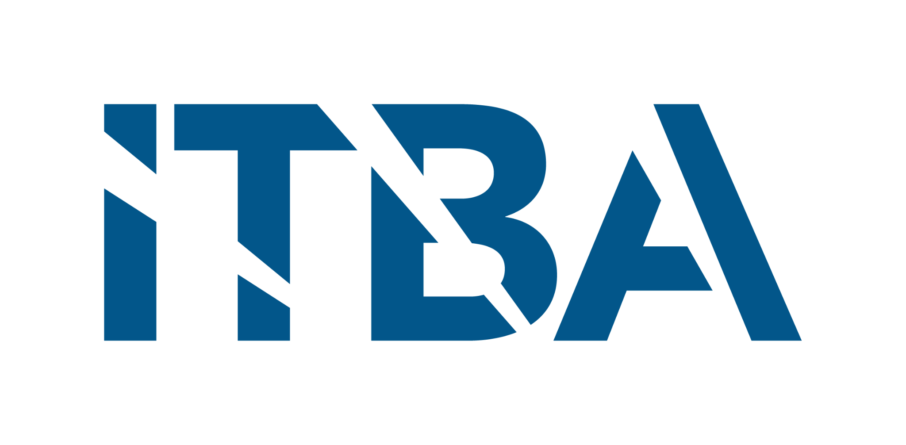
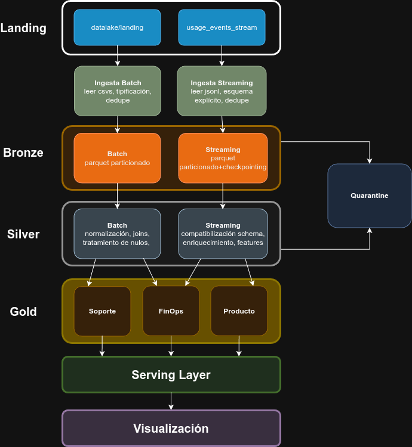

**72.80 - Big Data**

Primer Parcial

Instituto Tecnológico de Buenos Aires

{width="2.5816119860017497in"
height="1.3171489501312337in"}

**Integrantes**:

- Barnatán, Martín Alejandro (64463)

- Bendayan, Alberto Leonel (62786)

- Boullosa Gutiérrez, Juan Cruz (63414)

**Fecha de Entrega**: 04/05/2026

2026

# **1. Introducción**

El presente informe describe el diseño preliminar de un pipeline de
datos para un proveedor de servicios en la nube. El objetivo del mismo
es ingestar, limpiar, conformar y publicar datos de clientes a fines de
realizar trabajos de analítica de FinOps, Soporte y Producto, construído
utilizando PySpark en Google Colab, Parquet como storage intermedio y
marts de analítica en AstraDB que son consultados mediante herramientas
que permitan una visualización.

#  

# **2. Diagrama de Arquitectura de Alto Nivel**

Dentro de los requerimientos impuestos, se mencionan tanto near
real-time para métricas operativas como batch diario/mensual para CRM y
facturación. Por estas razones, se decidió utilizar una arquitectura
Lambda por sobre una Kappa ya que la primera permite tener procesamiento
batch y streaming simultáneamente, mientras que la segunda se basa en
procesar todo únicamente en tiempo real.

{width="5.19245406824147in"
height="5.652777777777778in"}

## **2.1 Landing**

La capa de Landing es una zona inmutable en la cual se guardan los
archivos CSV y los JSONL sin que se les realice ningún tipo de
modificación.

## **2.2 Ingesta**

La ingesta implica la lectura y procesamiento de los archivos en Landing
con Spark. Para Batch, se leen los archivos CSV, se tipifica, se hace
dedupe por *event_id* y se escriben los datos a Parquet. Se agregan
metadatos de ingesta como *ingest_ts* y *source_file* para trazabilidad.
Para Streaming, se leen los JSONL, se arma un esquema explícito de los
datos, se realiza dedupe de la misma forma y también se sirven los datos
en Parquet, en este caso particionando por fecha (la cual se extrae del
timestamp) y mediante el uso de checkpointing, con el objetivo de que se
retome la lectura de eventos desde el último leído ante una caída.
También se utiliza *withWatermark,* como medida de diseño defensivo,
para manejar los datos que llegan tarde y acotar el estado del dedupe en
memoria. La idea es que el diseño pueda funcionar en un ambiente
productivo donde pueda existir late data y donde debemos contemplar
decisiones de diseño defensivo.

## **2.3 Bronze Layer**

Es la primera capa de estandarización. Los datos se encuentran guardados
en Parquet con tipos de datos consistentes, registros deduplicados y
marcas de ingesta. En esta capa todavía no hay transformaciones de
negocios y se envían a Quarantine todos aquellos registros que no
cumplan con validaciones básicas.

## **2.4 Silver Layer**

Es la capa encargada de llevar a cabo la normalización de los datos y de
cruzar tablas, con el objetivo de dejarlos limpios y enriquecidos para
servirlos a la capa Gold. Envía a Quarantine todos los registros para
los cuales hay problemas que no se pueden resolver. A su vez, en esta
capa se calculan features analíticas clave para negocio, tales como
costos diarios (daily_cost_usd), métricas de uso (cpu_hours,
storage_gb_hours), consumo de GenAI (genai_tokens) y huella de carbono
(carbon_kg), además de flags básicos de anomalía. Estas métricas
alimentan los marts de negocio en la capa Gold. Se utiliza la API de
DataFrames de PySpark (SparkSQL).

## **2.5 Quarantine**

Es el registro de errores. Aquellos registros provenientes de Bronze y
Silver que tengan errores no resolubles se guardan en esta capa a través
de Parquet.

## **2.6 Gold Layer**

Es la capa en la cual se encuentran las tablas listas para responder
preguntas de negocio. El objetivo es que tanto desde Soporte, FinOps y
Producto se pueda consultar registros de una tabla sin que haya
necesidad alguna de hacer joins ni cálculos. En esta capa se cargan los
marts de negocio, los cuales incluyen métricas previamente calculadas en
Silver, como costos diarios, uso de recursos y consumo de GenAI.

## **2.7 Serving Layer**

Se trata de la capa en la cual los marts de negocio se cargan en AstraDB
para ser consultados, donde luego se realizan las consultas
correspondientes.

## **2.8 Visualization Layer**

Es la capa desde la cual se visualizan como dashboards los datos que
están guardados en AstraDB. Esta visualización puede realizarse con
herramientas como Tableau, Power BI, Superset o Grafana.

#  

# **3. Mapeo de requisitos a componentes**

A continuación, se detalla el mapeo de requisitos a cada uno de los
componentes mencionados en la sección anterior.

## **3.1 Procesamiento en tiempo real**

Se especifica en los requerimientos la necesidad de near real-time para
métricas operativas de uso y consumo. Para esto, se utiliza *Spark
Structured Streaming*, que permite procesar los *JSONL* de eventos
mediante microlotes continuos, watermarks para datos que se queden
viejos en el tiempo y checkpointing para resolver problemas de
idempotencia. Acorde a lo mencionado, esto nos otorga ***Velocidad***.

## **3.2 Procesamiento batch diario/mensual**

Se utiliza *SparkSQL* en modo batch, procesando los datos maestros, la
facturación y las encuestas NPS periódicamente usando *spark.read* y
transformaciones sobre DataFrames.

## **3.3 Almacenamiento escalable**

En el trabajo se utilizan dos tecnologías de almacenamiento: *Parquet* y
*AstraDB*. Parquet se utiliza como almacenamiento intermedio entre las
diferentes capas, mientras que *AstraDB* cubre el almacenamiento final
para las consultas. Ambos son escalables: en Parquet se pueden seguir
agregando archivos y particiones sin degradar la lectura, mientras que
*AstraDB* está basado en *Cassandra*, por ende se pueden agregar más
nodos al cluster y escalar horizontalmente. De esta forma, se puede
manejar un gran ***Volumen*** de información en ambas etapas del
pipeline.

## **3.4 Datos heterogéneos con evolución de esquema**

Para esto, se utiliza *PySpark* con manejo de diferentes
*schema_version* (acorde a lo mencionado en los requerimientos, v1 y
v2). De esta forma, podemos aprovechar *Spark* para leer múltiples
formatos distintos, otorgando a nuestro sistema ***Variedad*** y
***Variabilidad*.**

## **3.5 Consultas de baja latencia para dashboards**

Como ya se ha mencionado, se utiliza *AstraDB* como Serving Layer.
*Cassandra* nos permite realizar consultas rápidas sobre grandes
volúmenes de datos. De esta forma, los datos quedan accesibles para
generar ***Valor*** al negocio.

## **3.6 Calidad de datos y control de errores**

Se implementan reglas de validación en *PySpark* y también está
Quarantine en *Parquet*. Se evalúan las reglas a través de *Spark SQL*.

## **3.7 Idempotencia y reprocesamiento sin datos duplicados**

Para garantizar la idempotencia y evitar el reprocesamiento sin datos
duplicados, se aprovecha el checkpointing de *Spark Structured
Streaming* y se implementan *upserts* con keys naturales en *Cassandra*.

## **3.8 Detección de anomalías**

La detección de anomalías se lleva a cabo mediante funciones de
*PySpark*, procesando las mismas en Silver y publicándolas en Gold en el
*cost_anomaly_mart*.

## **3.9 Entorno de ejecución**

Todo el pipeline se ejecuta con PySpark en Google Colab. Si bien no
constituye un entorno productivo dado que las sesiones tienen tiempo
límite y los recursos son compartidos, resulta adecuado para el volumen
de datos del proyecto.

## **3.10 Visualización**

Se consumen los marts de *Cassandra* a través de herramientas como
*Tableau*, *Power BI*, *Superset* o *Grafana*, conectándose las mismas a
*AstraDB*.

#  

# **4. Flujo de Datos (Data Pipeline)**

El pipeline está compuesto por dos caminos paralelos que convergen en la
capa Gold, tanto para Soporte como FinOps y Producto. El camino Batch
procesa los archivos CSV maestros y de facturación, mientras que el
camino Streaming procesa los eventos de uso en tiempo real.

## **4.1 Camino Batch**

Los archivos *customers_orgs.csv*, *users.csv*, *resources.csv*,
*billing_monthly.csv*, *nps_surveys.csv* y *support_tickets.csv* se
ubican en la zona de Landing sin modificaciones. Desde allí, el job de
ingesta Batch los lee aplicando un esquema explícito, castea los tipos
de datos, agrega las columnas de trazabilidad *ingest_ts* y
*source_file*, y realiza un dedupe por clave primaria natural de cada
entidad. El resultado se persiste en Bronze como Parquet particionado.

En Silver, el job batch toma los Parquet de Bronze, realiza los joins
necesarios, normaliza campos o descarta nulos según las reglas
definidas, y calcula las features analíticas. Los registros que no
superan las validaciones se derivan a Quarantine brindando
observabilidad para aquellos datos que no pasaron las reglas impuestas.

## **4.2 Camino Streaming**

Los archivos *JSONL* del directorio usage_events_stream/ simulan un feed
continuo de eventos. El job de Structured Streaming los lee, aplicando
un esquema explícito que contempla ambas schema versions. Se aplica
*withWatermark* sobre el campo *event_ts* para manejar data tardía, y se
realiza dedupe por *event_id* dentro de cada ventana. Los lotes
resultantes se escriben en Bronze Streaming como Parquet particionado
por fecha.

En Silver Streaming, se compatibilizan los esquemas entre versiones, se
enriquecen los eventos con datos de orgs/users/resources, y se calculan
features incrementales.

## **4.3 Capa Gold**

Ambos caminos convergen en Gold, donde se materializan los marts de
negocio listos para ser consumidos sin necesidad de joins adicionales:

[FinOps:]{.underline} *org_daily_usage_by_service*,
*revenue_by_org_month*, *cost_anomaly_mart*.

[Soporte:]{.underline} *tickets_by_org_date* con métricas de SLA breach
rate y CSAT promedio.

[Producto:]{.underline} *genai_tokens_by_org_date* con costo estimado
por tokens.

## **4.4 Serving y Visualización**

Los marts Gold se cargan en AstraDB, usando el conector Spark--Cassandra
o mediante *foreachBatch* con el driver Python, modelando las tablas
priorizando el patrón de acceso.

#  

# **5. Asunciones y Riesgos Iniciales**

#### **5.1 Asunciones**

**Volumen de datos manejable en Colab.** Se asume que el volumen de
datos del proyecto no supera el límite de procesamiento de Google Colab.
De esta manera, no es requerido un cluster Spark distribuido real. En un
entorno productivo, el mismo código correría sobre un cluster con
múltiples nodos.

**Esquema de eventos estable en dos versiones.** Se asume que los
eventos de uso presentan únicamente dos versiones de esquema (v1 y v2) y
que no aparecerán versiones adicionales durante el procesamiento.

**Archivos *JSONL* como simulación de stream.** Se asume que los
archivos fragmentados en usage_events_stream constituyen una
representación válida de un feed de eventos continuo, y que el orden de
llegada de los archivos simula la secuencia temporal real de los
eventos.

**Tipos de cambio fijos por registro.** Se asume que el campo
exchange_rate_to_usd en billing_monthly.csv refleja el tipo de cambio
vigente al momento de emisión de cada factura y que no requiere
actualización retroactiva.

#### **5.2 Riesgos y Mitigaciones**

**Latencia en streaming sin broker dedicado.** Al utilizarse un
directorio local como fuente del stream en lugar de un broker, no existe
buffer de mensajes ante caídas del productor. La mitigación es el
checkpointing de Spark, que garantiza que ante un reinicio el pipeline
retome desde el último microlote procesado sin pérdida de eventos.

**Calidad de datos heterogénea en los CSVs.** Los archivos maestros
presentan nulos, valores ruidosos y tipos ambiguos. El riesgo es que por
culpa de reglas de validación demasiado estrictas se derive en una gran
cantidad de registros a Quarantine, reduciendo la cobertura de los marts
Gold. La mitigación consiste en completar o estimar los valores
faltantes donde sea razonable y reservar Quarantine únicamente para
errores que comprometan la integridad referencial.

**Evolución de esquema no anticipada.** De aparecer una
schema_version=v3 con campos adicionales, el pipeline no la reconocería.
La mitigación es diseñar el esquema de ingesta con campos nullable por
defecto y una validación explícita de schema_version que derive a
Quarantine cualquier versión desconocida en lugar de interrumpir el job.

**Idempotencia en reprocesamiento batch.** De ejecutarse un job batch
dos veces sobre el mismo período, podrían generarse registros duplicados
en Bronze. La mitigación es utilizar modo overwrite al escribir Parquet
particionado, de forma que reescribir una partición existente la
reemplace en su totalidad.

#  

# **6. Estimación de Esfuerzo y Recursos**

#### **6.1 Equipo**

El equipo está conformado por tres integrantes con dedicación parcial al
proyecto. Las responsabilidades se distribuyen en torno a tres ejes
principales: diseño e ingesta, transformaciones y calidad de datos, y
serving y consultas. Todos los integrantes participan del diseño general
y de la integración final del pipeline.

#### **6.2 Estimación de Tiempo**

Se estima un esfuerzo total de 30 a 50 horas distribuidas a lo largo de
tres semanas. La mayor parte del esfuerzo se concentra en las etapas de
transformación Silver y la carga a AstraDB, dado que son las más
complejas en términos de lógica de negocio y configuración. El diseño de
arquitectura y la documentación representan una porción menor pero
transversal a todo el desarrollo.

#### **6.3 Recursos Técnicos**

El entorno de ejecución es Google Colab, que provee cómputo sin
necesidad de infraestructura propia. Las tecnologías utilizadas son
PySpark para el procesamiento, Parquet como formato de almacenamiento
intermedio y AstraDB en su capa gratuita como base de datos Cassandra
para la Serving Layer. No se requieren recursos de infraestructura
adicionales.

#  

# **7. Conclusión**

El presente documento describe el diseño preliminar de un pipeline de
datos para un proveedor de servicios en la nube, abarcando desde la
ingesta de datos crudos hasta la publicación de marts de negocio listos
para ser consultados.

La arquitectura Lambda adoptada responde directamente a los requisitos
del sistema. El camino batch cubre el procesamiento periódico de datos
maestros y de facturación. Por otra parte, el camino streaming atiende
la necesidad de procesamiento real de eventos de uso. Ambos caminos
convergen en una capa Gold que centraliza la información para los
dominios de FinOps, Soporte y Producto.

Las decisiones de diseño tomadas apuntan a construir un pipeline
robusto, trazable y preparado para escalar ante un crecimiento en el
volumen de datos. Y como próximos pasos, se prevé la implementación
efectiva del pipeline.

Notas

### **1. El framing de apertura: vincular el negocio con las 5 V\'s**

Antes de hablar de Spark o Cassandra, anclar el problema en las **5 V\'s
de Big Data**, porque es el lenguaje del profesor:

- **Volumen**: múltiples fuentes (CSVs maestros, JSONL de eventos
  fragmentados que simulan micro-lotes) que en producción crecerían sin
  techo. Por eso elegimos un stack que escala horizontalmente (Parquet
  particionado + Cassandra/AstraDB basado en cluster).

- **Velocidad**: el negocio exige *near real-time* para uso/consumo y
  *batch* para CRM/facturación. Esto **es** la justificación de Lambda.

- **Variedad**: datos estructurados (CSVs) y semi-estructurados (JSONL
  con esquemas v1/v2 distintos). Spark nos permite tratar ambos con un
  solo motor.

- **Variabilidad**: la evolución de esquema (carbon_kg y genai_tokens
  aparecen \~45 días atrás como schema_version=2) es exactamente este
  concepto. Lo gestionamos con esquema explícito y campos nullable.

- **Valor**: los marts Gold (FinOps, Soporte, Producto) son el output
  que genera valor --- no el pipeline en sí. Conviene cerrar diciendo
  *\"todo el esfuerzo se traduce en que un analista pueda consultar
  Cassandra en milisegundos sin hacer joins\"*.

Nota teórica útil: el profesor mencionó que las 3 originales eran
Volumen/Velocidad/Variedad y luego se agregaron Valor y Variabilidad.
Vale la pena reconocerlo.

### **2. Justificación de Lambda sobre Kappa (este punto va a ser MUY preguntado)**

El profesor enseñó las dos arquitecturas explícitamente y va a querer
escuchar el trade-off. El argumento fuerte:

**Por qué Lambda y no Kappa:**

- Los requerimientos piden **explícitamente** dos cosas: near real-time
  **Y** batch diario/mensual. Kappa trataría todo como stream, lo cual
  es forzar la herramienta --- los CSVs maestros, NPS y facturación
  mensual no son streams naturales.

- **Resiliencia**: la capa batch sirve como \"fuente de verdad\"
  reconstruible. Si el streaming falla, el histórico se puede regenerar
  desde Landing.

- **Exactitud**: la facturación mensual no admite aproximaciones ---
  necesita el rigor del batch. El streaming sirve para métricas
  operativas donde \"casi en tiempo real\" es suficiente.

**Reconocer las desventajas (esto suma puntos):**

- Duplicación de lógica entre capa batch y speed.

- Mayor costo operacional al mantener dos rutas.

- Mitigamos parcialmente esto unificando el motor (PySpark para ambos
  caminos) y compartiendo el esquema Bronze/Silver/Gold.

**Si pregunta por Kappa:** sería razonable si tuviéramos Kafka como bus
central y todos los maestros llegaran como CDC streams. No es nuestro
caso.

### **3. Zonas del Data Lake: Medallion Architecture**

Acá tienen que mostrar que entienden por qué cada capa existe, no solo
nombrarlas:

- **Landing (inmutable)**: trazabilidad y reprocesabilidad. Si
  descubrimos un bug en Silver dentro de 6 meses, podemos rebuildear
  todo desde acá. Es la \"fuente de verdad cruda\".

- **Bronze**: tipificación y dedupe, **sin lógica de negocio**. Esto es
  clave --- un error frecuente es meter joins acá. Bronze es \"lo mismo
  que Landing pero limpio técnicamente\".

- **Silver**: acá ocurre el conformance --- joins, normalización,
  features (daily_cost_usd, cpu_hours, genai_tokens, carbon_kg),
  detección de anomalías. Es la capa más cara en esfuerzo y donde está
  la lógica de negocio.

- **Gold**: marts orientados por **query-first**. Cada tabla responde a
  una pregunta de negocio sin joins.

- **Quarantine**: mostrar que no es \"tirar errores a la basura\", es
  **observabilidad**. Permite saber qué porcentaje de datos no pasan
  validación y mejorar las reglas iterativamente.

**Punto fuerte para defender:** Parquet como formato intermedio.
Justificar con: columnar (lecturas selectivas baratas), compresión,
schema evolution nativo, particionado físico que Spark explota con
*partition pruning*.

### **4. Streaming: los detalles técnicos que diferencian**

Esto es lo que separa una respuesta de 7 de una de 10. Los conceptos a
mencionar **explícitamente**:

- **Esquema explícito** en lugar de inferido: en producción, inferir
  esquema sobre archivos JSONL es lento y peligroso (puede cambiar entre
  lotes).

- **withWatermark sobre event_ts**: permite manejar **late data** y, lo
  más importante, **acotar el estado del dedupe en memoria**. Sin
  watermark, el estado crecería indefinidamente. Esta es una decisión de
  diseño defensivo que vale la pena destacar.

- **Checkpointing**: garantiza **idempotencia y exactly-once semantics**
  ante caídas. Spark guarda el offset del último micro-batch procesado.

- **Dedupe por event_id dentro de la ventana del watermark**: combina
  las dos garantías --- no duplicados Y estado acotado.

- **Particionado por fecha** en Bronze streaming: facilita
  reprocesamiento por día y partition pruning en lecturas downstream.

**Frase para soltar:** *\"diseñamos el streaming pensando en un broker
real (Kafka) detrás, aunque en la simulación sea un directorio local ---
las decisiones de watermark y checkpointing aplican igual\"*.

### **5. Evolución de esquema (v1 → v2)**

El profesor metió esto a propósito en los datos. Hay que mostrar que lo
detectaron y lo manejaron:

- Esquema explícito con campos nullable (carbon_kg, genai_tokens).

- Validación de schema_version que deriva versiones desconocidas a
  Quarantine en lugar de romper el job. Esto es **resiliencia ante v3
  futuro**.

- En Silver se compatibilizan ambas versiones a un esquema unificado.

Esto demuestra entender **Variabilidad** como V de Big Data en la
práctica, no solo en la teoría.

### **6. Cassandra / AstraDB: modelado query-first**

Punto clave que el profesor va a apretar:

- Cassandra **no se modela como una RDBMS**. Se modela una tabla por
  consulta (denormalización total).

- Los marts Gold ya están listos para esto: org_daily_usage_by_service
  tiene como partition key (org_id, usage_date) y eso responde la
  consulta 1 y 2 sin joins.

- **Idempotencia**: Cassandra hace upserts por primary key naturalmente.
  Reprocesar un día batch sobrescribe en lugar de duplicar.

- **Escalabilidad horizontal**: agregar nodos al ring. Volumen cubierto.

- **Baja latencia**: dashboards en Tableau/PowerBI/Superset/Grafana
  consumen sin sufrir.

**Si pregunta \"por qué Cassandra y no Postgres\":** Cassandra está
optimizada para writes masivos y reads por partition key, exactamente el
patrón de un mart analítico. Postgres no escala horizontalmente con la
misma facilidad.

### **7. Calidad de datos e idempotencia (los talones de Aquiles)**

Conviene anticipar las preguntas mostrando que pensaron los puntos
débiles:

- **Reglas de validación**: event_id no nulo y único, cost_usd_increment
  ∈ \[-0.01, +∞), flags de anomalía con z-score / MAD / percentiles.

- **Idempotencia batch**: mode=overwrite en escritura de particiones
  Parquet. Reescribir una partición la reemplaza completa.

- **Idempotencia streaming**: checkpointing + dedupe por event_id +
  upsert en Cassandra (la PK natural absorbe duplicados).

- **Quarantine como observabilidad**, no como descarte.

### **8. Riesgos asumidos (sé honesto, esto siempre cae bien)**

Tres que conviene mencionar antes de que pregunte:

1.  **Colab no es producción**: sesiones con timeout, recursos
    compartidos. El mismo código corre sobre un cluster real (EMR,
    Dataproc, Databricks).

2.  **Directorio local en lugar de broker**: sin buffer ante caída del
    productor. Mitigado por checkpointing.

3.  **Sin v3 anticipada**: el sistema sobrevive con campos nullable y
    desvío a Quarantine, pero requeriría una iteración de código.

### **9. Storytelling sugerido (estructura del discurso)**

El PDF del proyecto valora **storytelling**. Una estructura que
funciona:

1.  **Problema de negocio** (1 min): \"somos el equipo de datos de un
    cloud provider, FinOps necesita ver costos diarios, Soporte necesita
    ver SLA breaches en tiempo casi real, Producto necesita medir
    adopción de GenAI\...\"

2.  **Las 5 V\'s del problema** (1 min): mapearlas a los datos
    provistos.

3.  **Decisión arquitectónica: Lambda y por qué no Kappa** (2 min).

4.  **Walkthrough de las capas** (3-4 min): Landing → Bronze → Silver →
    Gold → Serving, mostrando el camino de un evento de usage y el
    camino de una factura mensual.

5.  **Decisiones técnicas finas** (2 min): watermark, checkpointing,
    particionado, query-first en Cassandra.

6.  **Demo de las 5 consultas mínimas** sobre AstraDB.

7.  **Riesgos y próximos pasos** (1 min).

### **10. Preguntas que probablemente haga el profesor (preparen respuestas)**

- *\"¿Por qué Lambda y no Kappa?\"* → tienen la respuesta arriba.

- *\"¿Qué hace withWatermark exactamente?\"* → maneja late data y acota
  el estado.

- *\"¿Cómo garantizan que reprocesar no duplique?\"* → checkpointing +
  overwrite + upsert por PK.

- *\"¿Por qué Parquet y no Avro/ORC?\"* → columnar, compresión,
  integración nativa con Spark, partition pruning.

- *\"¿Por qué Cassandra y no un data warehouse tipo
  Snowflake/BigQuery?\"* → query-first con baja latencia para
  dashboards, escalabilidad horizontal, costo, y porque el requisito lo
  pide explícitamente.

- *\"¿Qué pasa si llega schema_version=3?\"* → Quarantine + alerta, sin
  romper el job.

- *\"¿Qué método de detección de anomalías eligieron?\"* → tienen tres
  opciones (z-score, MAD, percentiles); sería bueno tener decidido cuál
  y por qué.

- *\"¿Cuál es el grano de cada mart Gold?\"* → tenerlos memorizados:
  (org_id, usage_date, service), (org_id, month), etc.

## **Stack tecnológico --- resumen ultra breve**

**Lenguaje / motor de procesamiento:** PySpark (API DataFrames + Spark
SQL)

**Entorno de ejecución:** Google Colab

**Procesamiento batch:** Spark SQL en modo batch (spark.read)

**Procesamiento streaming:** Spark Structured Streaming (con
withWatermark + checkpointing + dedupe por event_id)

**Landing (raw inmutable):** archivos CSV y JSONL en directorio local

**Bronze / Silver / Quarantine (storage intermedio):** Parquet
particionado

**Gold (marts de negocio):** Parquet particionado → cargado a Cassandra

**Serving Layer:** AstraDB (Cassandra managed)

**Carga Spark → Cassandra:** conector Spark-Cassandra o foreachBatch +
driver Python

**Visualización:** Tableau / Power BI / Superset / Grafana (cualquiera
conectado a AstraDB)

**Detección de anomalías:** funciones PySpark en Silver (z-score / MAD /
percentiles)

**Idempotencia:** checkpointing de Structured Streaming + mode=overwrite
en Parquet + upserts por PK natural en Cassandra

## 

## **Capas del pipeline --- resumen breve**

**Landing:** zona inmutable donde aterrizan los archivos crudos (CSV y
JSONL) tal cual llegaron, sin tocarlos. Es la fuente de verdad para
reprocesar.

**Ingesta:** lectura de Landing con Spark, aplicando esquema explícito,
casteo de tipos, dedupe y agregado de metadatos de trazabilidad
(ingest_ts, source_file).

**Bronze:** primera capa estandarizada. Mismos datos que Landing pero
tipificados, deduplicados y en Parquet. **Sin lógica de negocio
todavía.**

**Silver:** capa de conformance. Acá ocurren los joins entre tablas,
normalización, tratamiento de nulos/outliers, compatibilización de
esquemas v1/v2, y cálculo de features analíticas (costos diarios,
cpu_hours, genai_tokens, carbon_kg, flags de anomalía).

**Quarantine:** repositorio paralelo en Parquet donde se desvían los
registros que no pasan validaciones en Bronze o Silver. Sirve para
observabilidad, no para descarte.

**Gold:** marts de negocio listos para consumir, modelados query-first
(FinOps, Soporte, Producto). Sin joins ni cálculos pendientes --- una
tabla por consulta.

**Serving:** los marts Gold se cargan a AstraDB (Cassandra) para
consultas de baja latencia.

**Visualización:** dashboards en Tableau / Power BI / Superset / Grafana
que consumen AstraDB.

## **Checkpointing y withWatermark**

### **Checkpointing**

Spark guarda en disco el progreso del stream (qué leyó y el estado
interno) después de cada micro-batch. Si el job se cae, al reiniciar
**retoma desde donde quedó** sin perder ni duplicar eventos. Es lo que
da exactly-once.

### **withWatermark**

Le dice a Spark hasta cuánto tiempo aceptar eventos que llegan tarde
(ej: \"hasta 10 minutos de atraso\"). Más viejo que eso, se descarta.
Sirve para **acotar la memoria** --- sin watermark, el estado de dedupe
y agregaciones crecería para siempre.

### **Juntos**

- **Watermark** → maneja late data y limita el estado en memoria.

- **Checkpointing** → garantiza recuperación ante caídas sin pérdida ni
  duplicación.
