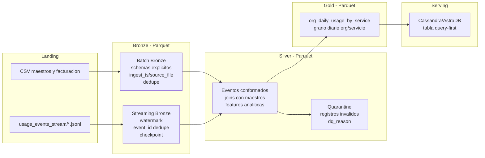

# Informe Segundo Parcial - Cloud Provider Analytics

**Materia:** 72.80 - Big Data  
**Entrega:** Segundo Parcial  
**Fecha:** 15/06/2026  
**Integrantes:**

- Barnatan, Martin Alejandro (64463)
- Bendayan, Alberto Leonel (62786)
- Boullosa Gutierrez, Juan Cruz (63414)

## 1. Objetivo

El objetivo de la entrega es demostrar un MVP tecnico end-to-end para el caso Cloud Provider Analytics, conectando las capas:

```text
Landing -> Bronze -> Silver -> Gold -> Serving Cassandra/AstraDB
```

La implementacion usa PySpark en Colab, Parquet como almacenamiento intermedio, Structured Streaming para eventos JSONL y Cassandra/AstraDB como capa de serving query-first.

## 2. Diagrama actualizado



## 3. Alcance implementado

El MVP cubre los requisitos obligatorios del segundo parcial:

- Batch a Bronze: ingesta de CSVs maestros y facturacion a Parquet, con tipificacion explicita, columnas tecnicas `ingest_ts`, `ingest_date`, `source_file` y dedupe por clave natural.
- Streaming a Bronze: lectura de `usage_events_stream/*.jsonl` con Structured Streaming, esquema explicito, `withWatermark`, dedupe por `event_id` y checkpointing.
- Silver: limpieza y conformado de eventos, enriquecimiento con organizaciones y recursos, y calculo de features analiticas.
- Calidad de datos: reglas activas y escritura de registros invalidos en Quarantine con `dq_reason`.
- Gold: mart FinOps `org_daily_usage_by_service`, con grano diario por organizacion y servicio.
- Serving: keyspace y tabla Cassandra/AstraDB modelada query-first para el mart anterior.
- Idempotencia: re-ejecucion sin duplicar mediante `overwrite`, dedupe, checkpointing y upserts por primary key.

## 4. Log de decisiones

### Patron Lambda/Kappa

Se mantiene un patron Lambda porque el caso combina dos necesidades distintas:

- procesamiento batch para datos maestros, facturacion, NPS, tickets y marketing;
- procesamiento near real-time para eventos de uso.

Kappa no se adopta porque obligaria a tratar todos los datos como stream, aunque varios insumos del proyecto son naturalmente batch. Para el MVP se reduce la complejidad usando PySpark como motor comun para ambos caminos.

### Capas del data lake

Landing se conserva inmutable como fuente cruda para reprocesamiento. Bronze agrega tipificacion, dedupe y columnas tecnicas sin incorporar logica de negocio. Silver realiza conformado, joins, reglas de calidad y features. Gold publica un mart de negocio listo para consulta. Quarantine mantiene observabilidad de registros que no cumplen las reglas de calidad.

### Particiones

- Bronze batch: particionado por `ingest_date`.
- Bronze streaming: particionado por `usage_date`.
- Silver events: particionado por `usage_date`.
- Gold FinOps: particionado por `usage_date`.

Estas particiones permiten validar rutas por capa, reprocesar periodos puntuales y mejorar lecturas con partition pruning.

### Calidad de datos y umbrales

Reglas activas:

1. `event_id` no nulo.
2. `event_ts` parseable y no nulo.
3. `unit` no nulo cuando existe `value`.
4. `cost_usd_increment >= -0.01`; valores menores se envian a Quarantine.
5. `schema_version` debe existir y pertenecer a las versiones esperadas `1` o `2`.

Ademas se calcula `is_cost_anomaly` cuando `cost_usd_increment < 0` o `cost_usd_increment > 50`. Los costos negativos leves se toleran como ajustes o creditos operativos, pero quedan marcados como anomalias para analisis posterior.

### Features Silver

Las principales features calculadas son:

- `daily_cost_usd`
- `requests`
- `cpu_hours`
- `storage_gb_hours`
- `genai_tokens`
- `carbon_kg`
- `is_cost_anomaly`

Estas columnas alimentan el mart Gold sin requerir joins adicionales en serving.

### Claves Cassandra

La tabla `org_daily_usage_by_service` se modela query-first:

```sql
PRIMARY KEY ((org_id), usage_date, service)
```

La partition key `org_id` permite consultar una organizacion especifica. Las clustering columns `usage_date` y `service` permiten recorrer el historial por fecha y discriminar los servicios de cada dia. Se usa orden descendente por `usage_date` para priorizar datos recientes en consultas de dashboard.

### Consultas de aceptacion

Las dos consultas minimas se responden desde la tabla `org_daily_usage_by_service`:

- costo y uso diario por organizacion, rango de fechas y servicio;
- detalle de servicios y anomalias para una organizacion en una fecha puntual.

### Idempotencia

Bronze batch, Silver y Gold escriben en modo `overwrite`. Streaming usa checkpointing y dedupe por `event_id`. Cassandra/AstraDB usa upserts por primary key deterministica, por lo que una re-ejecucion reemplaza los mismos registros logicos en lugar de duplicarlos.

## 5. Artefactos de entrega

- `notebooks/segundo_parcial_big_data.ipynb`: notebook reproducible para Colab.
- `src/tp2_pipeline.py`: modulo PySpark reutilizable.
- `cql/01_create_keyspace.cql`: creacion de keyspace.
- `cql/02_create_tables.cql`: tabla query-first del mart FinOps.
- `cql/03_queries_demo.cql`: consultas de aceptacion.
- `docs/decision_log.md`: decisiones tecnicas resumidas.
- `docs/evidencias.md`: checklist de evidencias a adjuntar.

## 6. Conclusion

La entrega implementa el end-to-end minimo pedido por la consigna: ingesta batch y streaming, capas Bronze/Silver/Gold en Parquet, reglas de calidad con Quarantine, mart FinOps y serving en Cassandra/AstraDB. El diseno conserva el criterio Lambda del TP1, pero acotado al MVP tecnico solicitado para el segundo parcial.
