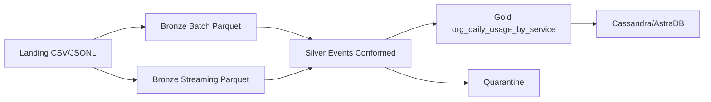

**72.80 - Big Data**

Segundo Parcial

Instituto Tecnologico de Buenos Aires

**Integrantes**:

- Barnatan, Martin Alejandro (64463)
- Bendayan, Alberto Leonel (62786)
- Boullosa Gutierrez, Juan Cruz (63414)

**Fecha de Entrega**: 15/06/2026

2026

# **1. Introduccion**

El presente informe documenta la implementacion minima funcional del pipeline propuesto en el primer parcial para el caso Cloud Provider Analytics. El objetivo del segundo parcial es demostrar un recorrido end-to-end funcionando desde Landing hasta Serving, usando PySpark, Parquet, Structured Streaming y Cassandra/AstraDB.

El alcance implementado cubre ingesta batch de maestros, ingesta streaming de eventos JSONL, conformado en Silver, reglas de calidad con Quarantine, un mart Gold FinOps y el modelo CQL query-first para publicar el resultado en Cassandra.

# **2. Arquitectura Implementada**

La arquitectura mantiene el patron Lambda definido en el TP1. El camino batch procesa maestros y facturacion desde CSV, mientras que el camino streaming procesa eventos de uso desde `usage_events_stream/*.jsonl`. Ambos caminos convergen en Silver y luego en Gold.

## **2.1 Landing**

Landing contiene los archivos originales sin modificacion: maestros CSV, facturacion, encuestas, tickets, marketing y eventos JSONL. Esta capa se conserva como fuente de verdad cruda para permitir reprocesamiento.

## **2.2 Bronze**

Bronze batch lee los CSV con esquemas explicitos, agrega `ingest_ts`, `ingest_date` y `source_file`, aplica dedupe por clave natural y persiste en Parquet.

Bronze streaming lee `usage_events_stream/*.jsonl` con esquema explicito, aplica `withWatermark` sobre `event_ts`, dedupe por `event_id`, checkpointing y escritura Parquet particionada por `usage_date`.

## **2.3 Silver**

Silver compatibiliza los eventos de schema_version 1 y 2, normaliza tipos, enriquece con organizaciones y recursos, calcula features analiticas y separa registros invalidos hacia Quarantine.

Features calculadas:

- `daily_cost_usd`
- `requests`
- `cpu_hours`
- `storage_gb_hours`
- `genai_tokens`
- `carbon_kg`
- `is_cost_anomaly`

## **2.4 Gold**

Gold materializa el mart FinOps `org_daily_usage_by_service`, con grano diario por organizacion y servicio. El mart queda listo para ser consultado sin joins.

## **2.5 Serving**

Serving se resuelve con Cassandra/AstraDB. La tabla se modela query-first con primary key `((org_id), usage_date, service)`, priorizando dashboards y consultas por organizacion y rango de fechas.

# **3. Requisitos de la Consigna**

## **3.1 Batch a Bronze**

El pipeline ingesta todos los CSV disponibles, incluyendo como minimo `customers_orgs.csv`, `users.csv` y `billing_monthly.csv`. Cada lectura usa tipificacion explicita, columnas tecnicas y dedupe cuando aplica.

## **3.2 Streaming a Bronze**

Structured Streaming lee los JSONL de eventos con esquema explicito. Se usa watermark de 2 dias, dedupe por `event_id`, manejo de late data y checkpointing en `checkpoints/usage_events_bronze`.

## **3.3 Silver y Calidad**

Reglas activas:

1. `event_id` no nulo.
2. `event_ts` no nulo luego del parseo.
3. `unit` no nulo cuando existe `value`.
4. `cost_usd_increment >= -0.01`.

Los registros que no cumplen se escriben en `quarantine/usage_events`. El resto se persiste en `silver/usage_events`.

## **3.4 Gold FinOps**

El mart `org_daily_usage_by_service` agrupa por `org_id`, `usage_date` y `service`, acumulando costos y metricas de uso. La salida se guarda en `gold/org_daily_usage_by_service`.

## **3.5 Cassandra**

Los scripts `cql/01_create_keyspace.cql`, `cql/02_create_tables.cql` y `cql/03_queries_demo.cql` crean el keyspace, la tabla query-first del mart FinOps y las consultas minimas:

- costo y uso diario por organizacion, fecha y servicio;
- detalle de servicios y anomalias para una organizacion en una fecha.

## **3.6 Idempotencia**

Las capas Parquet se escriben en modo `overwrite`, por lo que una re-ejecucion reemplaza la salida previa. En Cassandra, la primary key deterministica permite upserts sin duplicar registros.

# **4. Evidencias a Adjuntar**

Al ejecutar el pipeline se deben adjuntar:

- conteos impresos por capa;
- rutas y archivos Parquet generados en Bronze, Silver y Gold;
- muestra de registros en Quarantine;
- captura de la tabla de Cassandra poblada;
- captura de las dos consultas CQL con resultados;
- conteos antes/despues de una re-ejecucion para demostrar idempotencia.

# **5. Conclusion**

La implementacion cumple el MVP solicitado para el segundo parcial. Se demuestra el recorrido completo del dato desde Landing hasta un mart Gold y su modelo de Serving en Cassandra, manteniendo las decisiones de arquitectura del TP1: Lambda, medallion architecture, Parquet como almacenamiento intermedio, Structured Streaming para velocidad y Cassandra/AstraDB como capa query-first de baja latencia.
